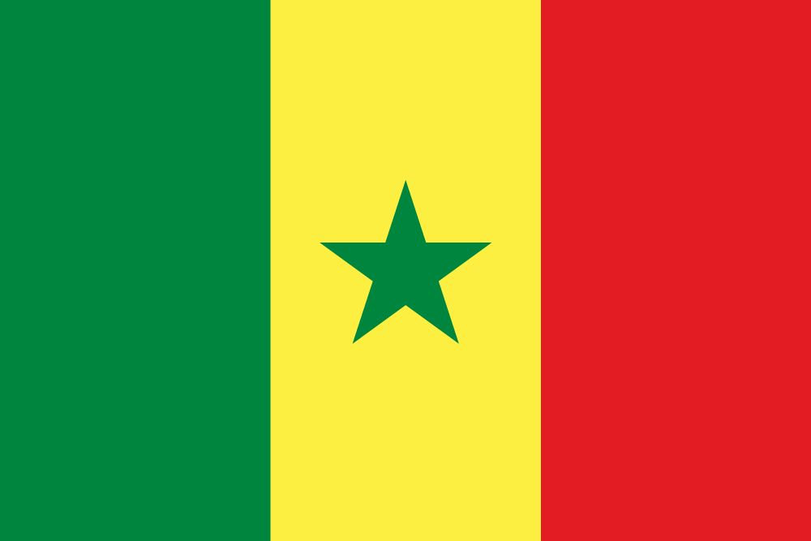

# Made In Senegal 

 

👨🏽‍💻 This is a collection of awesome tools built by Senegalese developers that can be used by anyone anywhere in the world.

<a href="#A">A</a> | <a href="#B">B</a> | <a href="#C">C</a> | <a href="#D">D</a> | <a href="#E">E</a> | <a href="#F">F</a> | <a href="#G">G</a> | <a href="#H">H</a> | <a href="#I">I</a> | <a href="#J">J</a> | <a href="#K">K</a> | <a href="#L">L</a> | <a href="#M">M</a> | <a href="#N">N</a> | <a href="#O">O</a> | <a href="#P">P</a> | <a href="#Q">Q</a> | <a href="#R">R</a> | <a href="#S">S</a> | <a href="#T">T</a> | <a href="#U">U</a> | <a href="#V">V</a> | <a href="#W">W</a> | <a href="#X">X</a> | <a href="#Y">Y</a> | <a href="#Z">Z</a>

## A

## B

- **[Bilan](https://github.com/daoodaba975/bilan)** - 💡 A basic BATCH program that allows you to calculate your points when playing Scrabble. **By [@daoodaba975](https://github.com/daoodaba975)**
- **[Blockchain Programming Golang](https://github.com/diop/blockchain-programming-golang)** - Blockchain Programming in Go. **By [@diop](https://github.com/diop)**

## C

- **[Change Password First](https://github.com/riftone07/changepasswordfirst)** - This package allows your users change their password on the first login. **By [@riftone07](https://github.com/riftone07)**
- **[COVID-19](https://github.com/senegalouvert/COVID-19)** - Senegal Coronavirus (COVID-19) Cases. **By [@senegalouvert](https://github.com/senegalouvert)**

## D

## E

## F

- **[Facebound](https://github.com/diop/facebound)** - Face Detection Web App. **By [@diop](https://github.com/diop)**
- **[Flutter JSON Fetch](https://github.com/diop/flutter-json-fetch)** - Flutter JSON Fetch. **By [@diop](https://github.com/diop)**

## G

- **[GalsenDev First Contributions](https://github.com/Galsen-Dev-LAB/galsendev-first-contributions)** - 👨🏽‍💻🙌🏽 Help newbies to contribute on open source projects. **By [@Galsen-Dev-LAB](https://github.com/Galsen-Dev-LAB)**
- **[Graph Tool Quickstart](https://github.com/eliaswalyba/graph-tool-quickstart)** - Graph tool is a very powerful tool for working with Graphs in C++ or Python. In this repo I exported the Quick start tutorial in their documentation as Jupyter Notebook and markdown to allow more interaction with the code. **By [@eliaswalyba](https://github.com/eliaswalyba)**
- **[Gulp Playground](https://github.com/NDOY3M4N/gulp-playground)** - A starter project for static website. **By [@NDOY3M4N](https://github.com/NDOY3M4N)**

## H

## I

- **[Indigo](https://github.com/diop/indigo)** - An image transformation utility written in Go. **By [@diop](https://github.com/diop)**

## J

## K

## L

- **[LaliaSprite](https://github.com/Shadoworker/LaliaSprite)** - Laliasprite is a PhaserJS based tool-framework that helps you to generate hitboxes for your 2D game characters and setup interactions with them (when animation is playing for example). **By [@Shadoworker](https://github.com/Shadoworker/LaliaSprite)**

## M

## N

## O

- **[Orbit Next Framework](https://github.com/orbitturner/orbitnextframework)** - This is a Funny Easy Simple Lighweight Senegalese PHP Framework that have been made to help Nebies and Pro devs to code in a different way. **By [@orbitturner](https://github.com/orbitturner)**

## P

- **[Paytech PHP Client](https://github.com/PapiHack/paytech-php-client)** - PHP SDK for PayTech Payment Gateway available via composer. **By [@PapiHack](https://github.com/PapiHack)**
- **[Predict](https://github.com/diop/predict)** - Machine Learning Prediction by SMS. **By [@diop](https://github.com/diop)**
- **[Processor](https://github.com/bcdbuddy/processor)** - Payment processor API integration. Includes Coinbase, Paypal, Payexpress, and so on. **By [@bcdbuddy](https://github.com/bcdbuddy)**
- **[Projects Spatium](https://github.com/orbitturner/PROJECTS_SPATIUM)** - This is a Folder / Projects Organizer web Page for serveur or Folders that contains many subfolders. **By [@orbitturner](https://github.com/orbitturner)**
- **[Python Weekly](https://github.com/Galsen-Dev-LAB/python-weekly)** - 🐍🎯 Python Weekly is a collection of some little tips with Python every week by @daoodaba975 **By [@Galsen-Dev-LAB](https://github.com/Galsen-Dev-LAB)**

## Q

## R

## S

- **[Samane](https://github.com/ngorseckframework/samanemvc)** - PHP Framework using MVC model developped by Ngor SECK! **By [@ngorseckframework](https://github.com/ngorseckframework)**
- **[Samane CLI](https://github.com/ngorseckframework/samane-cli)** - A fast and powerful CLI written in nodejs allowing you to optimize the repetitive tasks of your Samane project. **By [@ngorseckframework](https://github.com/ngorseckframework)**
- **[senegal YouTuber Dev List](https://github.com/daoodaba975/senegal-YouTuber-Dev-List)** - 📺 A list of Senegalese development channels on YouTube **By [@daoodaba975](https://github.com/daoodaba975)**

## T

- **[Taarú](https://github.com/daoodaba975/taaru)** - 🚀 A nice VS Code theme with Senegalese beauty, for coding the world. **By [@daoodaba975](https://github.com/daoodaba975)**

## U

## V

- **[VS Code Mediaplayer](https://github.com/sir-kain/vscode-mediaplayer)** - Mediaplayer extention for VS Code. **By [@sir-kain](https://github.com/sir-kain)**

## W

## X

- **[Xoos.js](https://github.com/Shadoworker/Xoos.js)** - JS based SVG drawing framework. **By [@Shadoworker](https://github.com/Shadoworker/LaliaSprite)**

## Y

## Z

- **[ZakuJS](https://github.com/Shadoworker/ZakuJS)** - ZakuJS is a JS framework for dealing with svg path rigging and transition (animation). **By [@Shadoworker](https://github.com/Shadoworker/LaliaSprite)**
